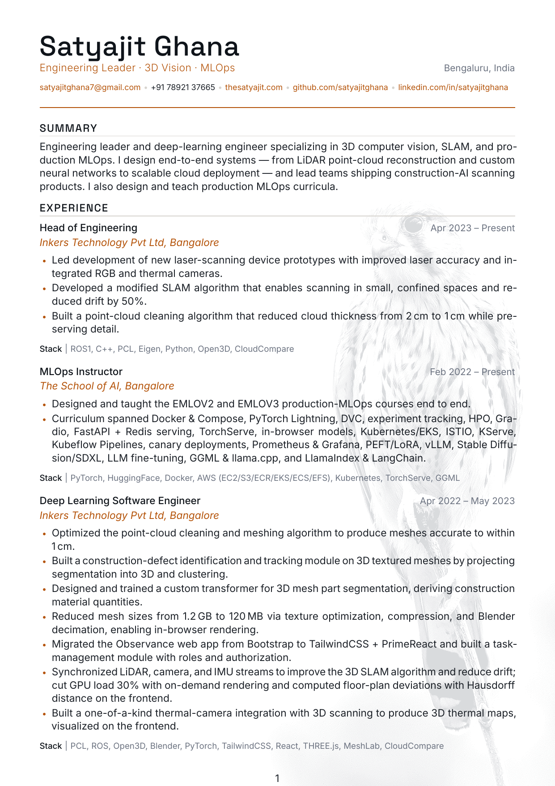
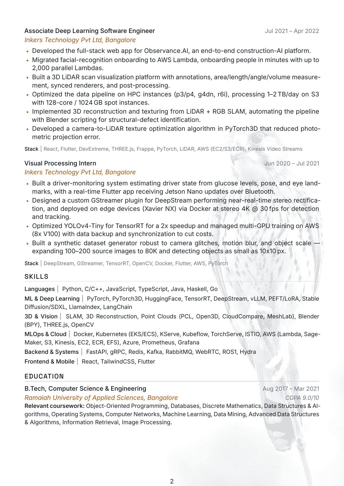

# Satyajit Ghana — Résumé

A clean, ATS-friendly resume typeset in XeLaTeX, with a faint dithered **kestrel**
watermark. Two PDFs are built from one source:

- **`build/resume.pdf`** — display version with the kestrel watermark (for your site / humans).
- **`build/resume-ats.pdf`** — identical text, **no background**. **Submit this one to ATS / job portals.**

<p align="center">
  
  
</p>

---

## Build

No system LaTeX needed — this uses [Tectonic](https://tectonic-typesetting.github.io/)
(a self-contained XeLaTeX engine) and [uv](https://docs.astral.sh/uv/) for the Python tooling.

```bash
# one-time: install Tectonic (single binary) if you don't have it
curl --proto '=https' --tlsv1.2 -fsSL https://drop-sh.fullyjustified.net | sh   # -> ./tectonic

make            # builds build/resume.pdf and build/resume-ats.pdf
make ats        # just the ATS version
make image      # regenerate the dithered kestrel watermark
make preview    # refresh the README preview PNGs
make check      # run the local open-source ATS checker (see below)
```

Fonts are **bundled** in `src/fonts/` (no system font install needed):
**[Space Grotesk](https://github.com/floriankarsten/space-grotesk)** for display, and
**[Inter](https://github.com/rsms/inter)** for body — both embedded into the PDF.

## ATS

The resume is built for clean machine parsing, following current
([2024–2026](https://www.jobscan.co/blog/resume-tables-columns-ats/)) best practice:

- Single column, real selectable text, standard headings (Experience / Education / Skills).
- Contact details (incl. a location line) live in the body — never in a page header/footer.
- Visible URLs that are also hyperlinked; `Mon YYYY` dates; round `•` bullets; ASCII-only symbols.
- No tables/columns for layout, no icons-as-text, no images carrying text.
- The **ATS PDF has no background image** — the watermark is display-only.

`make check` runs `scripts/ats_check.py`, a local checker assembled from the same
open-source engines real ATS use — **pdfminer.six** + **PyMuPDF** for extraction and
**spaCy** for NER — and prints a transparent parse + content score. Current result on
`build/resume-ats.pdf`: **100/100**.

> Note: `pyresparser` (the popular pip parser) is abandoned and won't load under
> spaCy 3.8 / Python 3.12, so this repo uses the underlying extraction engines directly.

## Layout

```
resume/
├── README.md
├── Makefile
├── build/                 # output PDFs (resume.pdf, resume-ats.pdf)
├── preview/               # PNG previews shown above
├── scripts/               # uv project: dither.py (watermark), ats_check.py (ATS score)
├── src/
│   ├── resume.tex         # display build  (kestrel watermark)
│   ├── resume-ats.tex     # ATS build      (defines \ATSMODE -> no watermark)
│   ├── resume-body.tex    # shared header + section includes
│   ├── style.tex          # fonts, palette, section/heading macros, watermark hook
│   ├── fonts/             # Space Grotesk + Inter (bundled)
│   ├── assets/            # kestrel-source.jpg, kestrel-dither.png, CREDITS.md
│   └── sections/          # summary, experience, skills, education
├── v1/                    # archived: original Adobe-design + Awesome-CV resumes
└── v2/                    # archived: 2024 LaTeX resume (resume-v2.pdf)
```

## Image credit

Kestrel photo by **Alexis Lours**, [CC BY 4.0](https://creativecommons.org/licenses/by/4.0),
via [Wikimedia Commons](https://commons.wikimedia.org/wiki/File:Eurasian_kestrel_2024_03_11_02.jpg) —
downscaled, grayscaled and Atkinson-dithered into a faint watermark by `scripts/dither.py`.
See `src/assets/CREDITS.md`.
